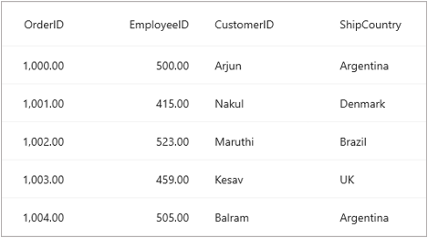

# How to parse XML file and set as ItemsSource for SfDataGrid
To parse the XML file include it as an EmbeddedResource in the portable project. To set data from the XML as ItemsSource of SfDataGrid, parse the XML data as stream and Deserialize the stream into a Collection using XmlSerializer.

Refer the below code example in which data from an XML file is parsed and set as ItemsSource for the SfDataGrid.
 
 ```XML
     public MainPage()
    {
        InitializeComponent();
        var assembly = typeof(MainPage).GetTypeInfo().Assembly;
        Stream? stream = assembly.GetManifestResourceStream("SfDataGridSample.Repository.xml");
        ObservableCollection<OrderInfo> OrdersInfo;
        XmlSerializer serializer = new XmlSerializer(typeof(ObservableCollection<OrderInfo>));
        OrdersInfo = (ObservableCollection<OrderInfo>)serializer.Deserialize(stream!)!;
        dataGrid.ItemsSource = OrdersInfo;
    } 
 ```
 
On executing the above code the below output is obtained.
 
 

[View sample in GitHub](https://github.com/SyncfusionExamples/How-to-parse-XML-file-and-set-as-ItemsSource-for-SfDataGrid)
 
Take a moment to explore this [documentation](https://help.syncfusion.com/maui/datagrid/overview), where you can find more information about Syncfusion .NET MAUI DataGrid (SfDataGrid) with code examples. Please refer to this [link](https://www.syncfusion.com/maui-controls/maui-datagrid) to learn about the essential features of Syncfusion .NET MAUI DataGrid (SfDataGrid).
 
##### Conclusion
 
I hope you enjoyed learning about how to parse XML file and set as ItemsSource for SfDataGrid.
 
You can refer to our [.NET MAUI DataGrid’s feature tour](https://www.syncfusion.com/maui-controls/maui-datagrid) page to learn about its other groundbreaking feature representations. You can also explore our [.NET MAUI DataGrid Documentation](https://help.syncfusion.com/maui/datagrid/getting-started) to understand how to present and manipulate data. 
For current customers, you can check out our .NET MAUI components on the [License and Downloads](https://www.syncfusion.com/sales/teamlicense) page. If you are new to Syncfusion, you can try our 30-day [free trial](https://www.syncfusion.com/downloads/maui) to explore our .NET MAUI DataGrid and other .NET MAUI components.
 
If you have any queries or require clarifications, please let us know in the comments below. You can also contact us through our [support forums](https://www.syncfusion.com/forums), [Direct-Trac](https://support.syncfusion.com/create) or [feedback portal](https://www.syncfusion.com/feedback/maui?control=sfdatagrid), or the feedback portal. We are always happy to assist you!
